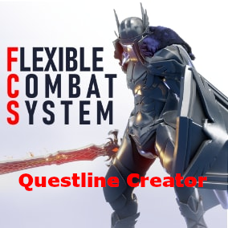

<!-- PROJECT LOGO -->
 

  

  <h3 align="center">FCS - Questline Creator</h3>

<!-- TABLE OF CONTENTS -->

  
Table of Contents

  <ol>
    <li>
      <a href="#about-the-project">About The Project</a>
      <ul>
        <li><a href="#built-with">Built With</a></li>
      </ul>
    </li>
    <li>
      <a href="#getting-started">Getting Started</a>
      <ul>
        <li><a href="#prerequisites">Prerequisites</a></li>
        <li><a href="#installation">Installation</a></li>
      </ul>
    </li>
    <li><a href="#usage">Usage</a></li>
    <li><a href="#roadmap">Roadmap</a></li>
    <li><a href="#contributing">Contributing</a></li>
    <li><a href="#license">License</a></li>
    <li><a href="#contact">Contact</a></li>
    <li><a href="#acknowledgments">Acknowledgments</a></li>
  </ol>

<!-- ABOUT THE PROJECT -->
## About The Project

This tool was created using the [Dear ImGui](https://github.com/ocornut/imgui) API and the Node Editor Template from [thedmd](https://github.com/thedmd/imgui-node-editor)

<!-- GETTING STARTED -->
## Getting Started

### Installation

1. Download the latest release from [here](https://firebasestorage.googleapis.com/v0/b/personalpage-2a66e.appspot.com/o/FCS%20-%20Questline%20Creator.msi?alt=media&token=317aa942-0cde-443a-a197-16964b512d74).
2. Install the Application

<!-- USAGE EXAMPLES -->
## Usage

You can add quests and characters with Right-Click (The characters are just to help keep track of the story)

You can edit the properties of the quests and characters by clicking the nodes.

You can also chain quests together to make a questline. The attributes will be set automaticly when exporting the quests.

You can save your progress in the menu and open it later. Everything will be placed where you left it.

When you are finished, you can export everything as a json file, which can be referenced in the data table from the FCS quests.

<!-- CONTACT -->
## Contact

Robert Sittig - robertsittig1996@web.de